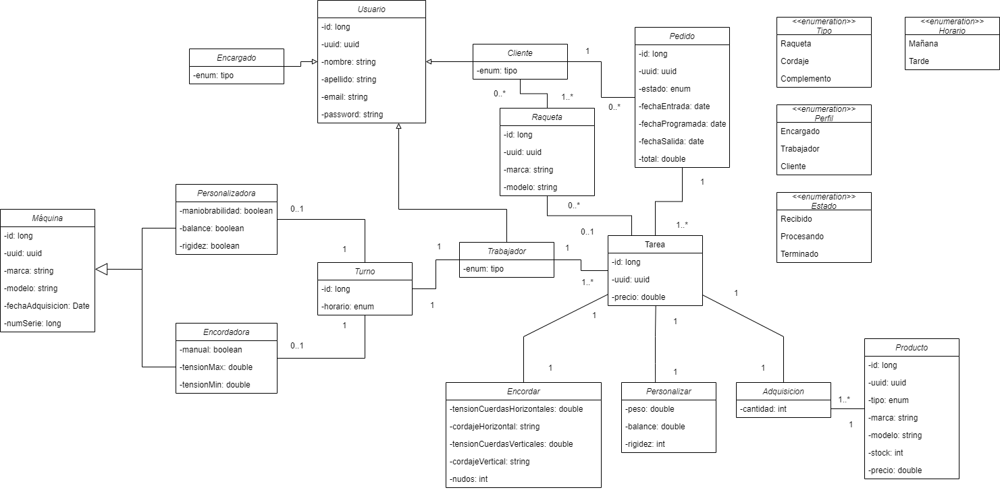

# TennisLab


Proyecto de gestión de base de datos de una tienda de raquetas para la asignatura Acceso a Datos del IES Luis Vives (
Leganés).

## [Vídeo de presentación](https://drive.google.com/file/d/19Bp-N-HHXtHFWn56nco5hsGuS10d6THZ/view?usp=share_link)

## Índice

- [Diseño](#diseño)
- [Estructura del proyecto](#estructura-del-proyecto)
- [Funcionamiento de la aplicación](#funcionamiento-de-la-aplicación)
- [Tests](#tests)

## Diseño

### Introducción

Para la realización de este proyecto, se ha pedido que se utilizara la tecnología Exposed de Kotlin. Los creadores
de [Exposed](https://github.com/JetBrains/Exposed#welcome-to-exposed-an-orm-framework-for-kotlin) definen su tecnología
así:
> Exposed es una biblioteca SQL ligera sobre el controlador JDBC para el lenguaje Kotlin. Exposed tiene dos tipos de
> acceso a la base de datos: DSL de ajuste SQL seguro de tipos y objetos ligeros de acceso a datos (DAO). Con Exposed
> puede tener dos niveles de bases de datos de acceso. Le gustaría utilizar Exposed porque el acceso a la base de datos
> incluye el ajuste DSL y un objeto ligero de acceso a datos. Además, nuestra mascota oficial es la sepia, que es bien
> conocida por su excelente capacidad de mimetismo que le permite mezclarse perfectamente en cualquier entorno. Al igual
> que nuestra mascota, Exposed se puede usar para imitar una variedad de motores de bases de datos y ayudarlo a crear
> aplicaciones sin dependencias en ningún motor de base de datos específico y cambiar entre ellos con muy pocos o ningún
> cambio.

Como podemos ver en la explicación anterior, se puede utilizar en diferentes motores de bases de datos, siendo en
nuestro caso [H2](https://www.h2database.com/html/main.html) la base en la que se sustentará nuestro proyecto.

Antes de empezar a 'pircar código', el primer paso para desarrollar un proyecto es diseñar el diagrama de clases. Este
diagrama nos permite visualizar cómo se desplegará nuestro proyecto. Así pues, y basándonos en las indicaciones del
ejercicio propuesto, nosotros consideramos que el diagrama de clases sea el siguiente:

### Diagrama de clases



### Configuración del proyecto

Hecho el diagrama, el siguiente pasó fue configurar el proyecto. En nuestro caso se
utilizó [Gradle](https://gradle.org/) para gestionar las dependencias que necesitaría el proyecto:

````kotlin
dependencies {
    //Test
    testImplementation(kotlin("test"))
    testImplementation("io.mockk:mockk:1.13.2")
    // Exposed
    implementation("org.jetbrains.exposed:exposed-core:0.39.2")
    implementation("org.jetbrains.exposed:exposed-dao:0.39.2")
    implementation("org.jetbrains.exposed:exposed-jdbc:0.39.2")
    implementation("org.jetbrains.exposed:exposed-java-time:0.39.2")
    // Base de Datos H2 Driver JDBC
    implementation("com.h2database:h2:2.1.214")
    // Si quiero usar DataTime de Jetbrains Kotlin
    implementation("org.jetbrains.kotlinx:kotlinx-datetime:0.3.2")
    // Kotlin's serialization JSON
    implementation("org.jetbrains.kotlinx:kotlinx-serialization-json:1.3.3")
    // Para hacer logs
    implementation("io.github.microutils:kotlin-logging-jvm:3.0.0")
    implementation("ch.qos.logback:logback-classic:1.4.1")
    // Para manejar un pool de conexions rápido con HikariCP
    implementation("com.zaxxer:HikariCP:5.0.1")
    // gson
    implementation("com.google.code.gson:gson:2.10")
    //Dokka Documentación Kotlin
    dokkaHtmlPlugin("org.jetbrains.dokka:kotlin-as-java-plugin:1.7.20")
}
````

Podemos ver que no solo hemos utilizado las dependencias de Exposed, sino también otras que nos han servido para manejar
el proyecto de una manera más amena y rápida, tales como los [Logs](https://github.com/MicroUtils/kotlin-logging) para
las salidas de texto en el terminal, [Gson](https://github.com/google/gson) para que los resultados de las búsquedas
salieran en formato [Json](https://es.wikipedia.org/wiki/JSON), [HikariCP](https://github.com/brettwooldridge/HikariCP)
para que la base de datos procesara más rápido la información. Por último, hemos
usado [Dokka](https://github.com/Kotlin/dokka) para que la documentación del código quedara más presentable.

### Configuración de la base de datos

La configuración de la base de datos se divide en tres puntos: por un lado, está el [DataBaseManager](#databasemanager),
el cual se encarga de iniciar, crear, limpiar y borrar la base de datos; por otro lado, tenemos la
clase [ConfigProject.Kt](#configuración-de-la-base-de-datos) y el archivo [config.properties], que configuran la base de
datos (nombre de la BBDD, el driver
que utiliza, la versión, etc). El resultado fue el siguiente:

#### DataBaseManager

````kotlin
object DataBaseManager {
    lateinit var config: ConfigProject

    fun init(config: ConfigProject) {
        this.config = config
        log.debug { "Inicializando la base de datos" }
        val hikariConfig = HikariConfig().apply {
            jdbcUrl = config.jdbcUrl
            driverClassName = config.jdbcDriver
            maximumPoolSize = config.jdbcPool
        }
        val dataSource = HikariDataSource(hikariConfig)
        Database.connect(dataSource)
        log.debug { "Base de datos inicializada exitosamente" }
        if (config.jdbcTablas) {
            crearTablas()
        }
    }

    private fun crearTablas() = transaction {
        log.debug { "Creando las tablas" }
        if (config.jdbcSQL)
            addLogger(StdOutSqlLogger)
        SchemaUtils.create(
            tablas
        )
        log.debug { "Tablas creadas" }
    }

    fun dropTablas() = transaction {
        log.debug { "Eliminando las tablas" }
        if (config.jdbcSQL)
            addLogger(StdOutSqlLogger)
        SchemaUtils.drop(
            tablas
        )
        log.debug { "Tablas eliminadas" }
    }

    fun clearTablas() = transaction {
        log.debug { "Limpiando tablas" }
        if (config.jdbcSQL)
            addLogger(StdOutSqlLogger)
        val tablas = arrayOf(
            tablas
        )

        tablas.forEach {
            it.deleteAll()
        }
        log.debug { "Tablas limpias" }
    }
}

````

#### Propiedades de la BBDD

````
nombre=TennisLab
version=1.0
jdbc.url=jdbc:h2:mem:tennisLab;DB_CLOSE_DELAY=-1;
jdbc.driver=org.h2.Driver
jdbc.maxPoolSize=10
jdbc.createTables=true
jdbc.showSQL=false
````

### Configuración con propiedades

````kotlin
data class ConfigProject(
    val nombre: String,
    val version: String,
    val jdbcUrl: String,
    val jdbcDriver: String,
    val jdbcPool: Int = 10,
    val jdbcTablas: Boolean = true,
    val jdbcSQL: Boolean = true
) {
    companion object {
        val DEFAULT = ConfigProject(
            nombre = "app",
            version = "1.0.0",
            jdbcUrl = "jdbc:h2:mem:test;DB_CLOSE_DELAY=-1;",
            jdbcDriver = "org.h2.Driver",
            jdbcPool = 10,
            jdbcTablas = true,
            jdbcSQL = true
        )

        fun fromProperties(file: String): ConfigProject {
            log.debug { "Cargando las propiedades del archivo $file" }
            val properties = Properties()
            properties.load(FileInputStream(file))
            return ConfigProject(
                nombre = properties.getProperty("nombre"),
                version = properties.getProperty("version"),
                jdbcUrl = properties.getProperty("jdbc.url"),
                jdbcDriver = properties.getProperty("jdbc.driver"),
                jdbcPool = properties.getProperty("jdbc.maxPoolSize").toInt(),
                jdbcTablas = properties.getProperty("jdbc.createTables").toBoolean(),
                jdbcSQL = properties.getProperty("jdbc.showSQL").toBoolean()
            )
        }
    }
}
````

Realizada la configuración, solo queda desarrollar las demás clases: modelos, repositorios, entidades, controladores,
etc.

## Estructura del proyecto

Para que nuestro proyecto estuviera lo más ordenado posible, se ha optado por una estructuración de clases basada en sus
funciones. Asi pues, se compartimentó las clases de la siguiente manera: Models, Entities, Mappers, Repositories y
Controllers,
además de las clases que gestionan las excepciones y el cifrado de las contraseñas.
Al tener muchas clases, se optará por enseñar una de ejemplo y así no ser repetitivos.

### Models

````kotlin
data class Adquisicion(
    val id: Long,
    @Expose val uuid: UUID = UUID.randomUUID(),
    @Expose var cantidad: Int,
    @Expose var producto: Producto? = null,
    @Expose var descripcion: String? = producto?.modelo,
    @Expose var precio: Double? = producto?.precio
) {
    override fun toString(): String {
        return GsonBuilder().setPrettyPrinting()
            .excludeFieldsWithoutExposeAnnotation()
            .create().toJson(this)
    }
}
````

Como podemos observar, esta clase está compuesta por una serie de atributos, además de una clase externa. Se han
utilizado las etiquetas @Expose para que, al imprimir por terminal la información, salga solo la información con dicha
etiqueta. En este caso, no queremos que el ID de la clase nos aparezca. Esto se complementa con el toString(), que
devuelve la información en formato Json, capando los atributos que aparecen o no.

### Entities

````kotlin
object AdquisicionTable : LongIdTable("adquisiciones") {
    val uuid = uuid("uuid")
    val producto = reference("producto_uuid", ProductoTable, onDelete = ReferenceOption.SET_NULL).nullable()
    val descripcion = varchar("descripcion", 50)
    val cantidad = integer("cantidad")
    val precio = double("precio")
}

class AdquisicionDao(id: EntityID<Long>) : LongEntity(id) {
    companion object : LongEntityClass<AdquisicionDao>(AdquisicionTable)

    var uuid by AdquisicionTable.uuid
    var producto by ProductoDao optionalReferencedOn AdquisicionTable.producto
    var descripcion by AdquisicionTable.descripcion
    var cantidad by AdquisicionTable.cantidad
    var precio by AdquisicionTable.precio
}
````

Esta clase se encarga de establecer la tabla: podemos ver que a cada atributo se le ha asignado un tipo de campo y el
nombre que llevará en la tabla

### Mappers

````kotlin
fun AdquisicionDao.fromAdquisicionDaoToAdquisicion(): Adquisicion {
    return Adquisicion(
        id = id.value,
        uuid = uuid,
        producto = producto?.fromProductoDaoToProducto(),
        descripcion = descripcion,
        cantidad = cantidad,
        precio = precio
    )
}
````

El mapper se encarga de transformar la información, mapearlo, y devolverlo en el tipo Objeto especificado

### Repositories

Para realizar los repositorios, primero se ha creado una interfaz genérica con una serie de funciones que implementarán
los demás repositorios.

````kotlin
interface CrudRepository<T, ID> {

    fun findAll(): List<T>

    fun findById(id: ID): T?

    fun save(entity: T): T

    fun delete(entity: T): Boolean
}
````

Para cada clase Model que diseñemos, tendremos dos más en el repositorio, una siendo de tipo Interfaz y otra que lo
implementará.

#### Interface

````kotlin
interface AdquisicionRepository : CrudRepository<Adquisicion, Long> {}
````

#### Implement

````kotlin
class AdquisicionRepositoryImpl(private val adquisicionDao: LongEntityClass<AdquisicionDao>) : AdquisicionRepository {

    override fun findAll(): List<Adquisicion> = transaction {
        log.debug { "findAll()" }
        adquisicionDao.all().map { it.fromAdquisicionDaoToAdquisicion() }
    }

    override fun findById(id: Long): Adquisicion? = transaction {
        log.debug { "findById($id)" }
        adquisicionDao.findById(id)?.fromAdquisicionDaoToAdquisicion()
    }

    override fun save(entity: Adquisicion): Adquisicion = transaction {
        val existe = adquisicionDao.findById(entity.id)
        existe?.let {
            update(entity, existe)
        } ?: run {
            insert(entity)
        }
    }

    private fun insert(entity: Adquisicion): Adquisicion {
        log.debug { "save($entity) - creando" }
        return adquisicionDao.new(entity.id) {
            uuid = entity.uuid
            producto = entity.producto?.let { ProductoDao.findById(it.id) }
                ?: throw GenericException("No existe producto")
            descripcion = entity.descripcion
                ?: throw GenericException("Error con la descripcion")
            cantidad = entity.cantidad
            precio = entity.precio!! * cantidad
        }.fromAdquisicionDaoToAdquisicion()
    }

    private fun update(entity: Adquisicion, existe: AdquisicionDao): Adquisicion {
        log.debug { "save($entity) - actualizando" }
        return existe.apply {
            uuid = entity.uuid
            producto = entity.producto?.let { ProductoDao.findById(it.id) }
                ?: throw GenericException("No existe producto")
            descripcion = entity.descripcion
                ?: throw GenericException("Error con la descripcion")
            cantidad = entity.cantidad
            precio = entity.precio!! * cantidad
        }.fromAdquisicionDaoToAdquisicion()
    }

    override fun delete(entity: Adquisicion): Boolean = transaction {
        val existe = adquisicionDao.findById(entity.id) ?: return@transaction false
        log.debug { "delete($entity)- borrando" }
        existe.delete()
        true
    }

}
````

### Controllers

En la clase Controller, diseñaremos las funciones que hará el CRUD (Create, Read, Update, Delete) en nuestro proyecto. A
este controlador se le inyectará el repositorio específico para cada clase.

````kotlin
class AdquisicionController(private val adquisicionRepository: AdquisicionRepository) {
    fun getAdquisiciones(): List<Adquisicion> {
        log.info("Obteniendo adquisiciones")
        return adquisicionRepository.findAll()
    }

    fun getAdquisicionById(id: Long): Adquisicion {
        log.info("Obteniendo adquisicion por id: $id")
        return adquisicionRepository.findById(id) ?: throw GenericException("Adquisicion con id $id no encontrada")
    }

    fun updateAdquisicion(adquisicion: Adquisicion) {
        log.info { "Actualizado adquisicion $adquisicion" }
        adquisicionRepository.save(adquisicion)
    }

    fun deleteAdquisicion(it: Adquisicion): Boolean {
        log.info { "Borrando adquisicion $it" }
        return if (adquisicionRepository.delete(it))
            true
        else
            throw GenericException("Adquisicion con id ${it.id} no encontrada")
    }

    fun createAdquisicion(adquisicion: Adquisicion): Adquisicion {
        log.info("Insertando nueva adquisicion")
        adquisicionRepository.save(adquisicion)
        return adquisicion
    }
}
````

### Cifrador y clase Exception

Parte de la práctica era transformar el password de los usuarios en
formato [SHA-512](https://es.wikipedia.org/wiki/SHA-2)

````kotlin
object Cifrador {

    fun encryptString(input: String): String {
        return try {
            val md = MessageDigest.getInstance("SHA-512")
            val messageDigest = md.digest(input.toByteArray())
            val no = BigInteger(1, messageDigest)
            var hashtext = no.toString(16)
            while (hashtext.length < 32) {
                hashtext = "0$hashtext"
            }
            hashtext
        } catch (e: NoSuchAlgorithmException) {
            throw RuntimeException(e)
        }
    }
}
````

Y para controlar las excepciones, o por lo menos para indicar dónde y qué función ha tenido un posible problema, se ha
creado una clase genérica que implementamos en diferentes clases de nuestro proyecto.

````kotlin
class GenericException(mensaje: String) : RuntimeException(mensaje) {}
````

La decisión de utilizar una única excepción es porque la alternativa era crear una por cada clase, pero teniendo el
mismo contenido y realizando lo mismo, por lo que simplificamos en una que nos funcionara en las demás clases.

## Funcionamiento de la aplicación

Nuestro trabajo culmina en la clase Main, donde iniciamos la base de datos con información con la que trabajar y el CRUD
de cada tabla creada. Al ser un Main tan extenso, enseñaremos el CRUD de una sola clase.

Para poder hacer el CRUD de una tabla, primero hemos creado una clase donde introducimos información. Como nuestro
ejemplo es la clase Adquisición, dicha clase implementa un objeto externo, en este caso la clase Producto. Es por ello,
que en el ejemplo, aparecerá información de las dos clases.

### Datos

````kotlin
fun getProductoInit() = listOf(
    Producto(
        id = 1L,
        tipo = Producto.Tipo.RAQUETA,
        marca = "Babolat",
        modelo = "Pure Aero",
        stock = 3,
        precio = 279.95
    ),
    Producto(
        id = 2L,
        tipo = Producto.Tipo.COMPLEMENTO,
        marca = "Wilson",
        modelo = "Dazzle",
        stock = 5,
        precio = 7.90
    )
)

fun getAdquisicionInit() = listOf(
    Adquisicion(
        id = 1L,
        cantidad = 1,
        producto = getProductoInit()[0],
    ),
    Adquisicion(
        id = 2L,
        cantidad = 1,
        producto = getProductoInit()[1],
    ),
)
````

Estando en Main, el último paso es realizar el CRUD, y para ello seguiremos un orden: Implementar los controladores de
cada clase, la inserción de información y el CRUD.
El resultado es el siguiente:

### Iniciar la base de datos

````kotlin
fun initDataBase() {
    val path =
        Paths.get("src" + File.separator + "main" + File.separator + "resources" + File.separator + "config.properties")
            .toString()
    val config = ConfigProject.fromProperties(path)
    println("Configuración: $config")

    DataBaseManager.init(config)
}
````

### Main

````kotlin
fun main(args: Array<String>) {
    log.info("TennisLab App")
    initDataBase()

    //Controllers
    val productosController = ProductoController(ProductoRepositoryImpl(ProductoDao))
    val adquisicionController = AdquisicionController(AdquisicionRepositoryImpl(AdquisicionDao))

    //Inserción de datos
    getProductoInit().forEach { producto ->
        productosController.createProducto(producto)
    }
    getAdquisicionInit().forEach { adquisicion ->
        adquisicionController.createAdquisicion(adquisicion)
    }
    //CRUD
    // Productos
    // FindAll
    val productos = productosController.getProductos()
    productos.forEach { println(it) }

    // Update
    val producto = productosController.getProductoById(1)
    producto.let {
        it.precio += 10.05
        productosController.updateProducto(it)
    }

    // FindById
    println(productosController.getProductoById(1))

    // Delete
    producto.let { if (productosController.deleteProducto(it)) println("Producto eliminado") }
    println(productosController.getProductos())

    //Adquisiciones
    // FindAll
    val adquisiciones = adquisicionController.getAdquisiciones()
    adquisiciones.forEach { println(it) }

    // Update
    val adquisicion = adquisicionController.getAdquisicionById(2)
    adquisicion.let {
        it.cantidad += 1
        adquisicionController.updateAdquisicion(it)
    }

    // FindById
    println(adquisicionController.getAdquisicionById(2))

    // Delete
    adquisicion.let { if (adquisicionController.deleteAdquisicion(it)) println(it) }
    println(adquisicionController.getAdquisiciones())
}
````

## Tests

Para comprobar que nuestro proyecto es estable, se han realizado una serie de test para comprobar el funcionamiento de
la aplicación. La opción que utilizamos para realizar dichos tests fue [Mockito](https://site.mockito.org/). Los tests
se ejecutaron a los repositorios y los controladores de cada clase. Para que no quede muy extenso, solo enseñaremos uno
de cada.

### ControllerTest

````kotlin
@ExtendWith(MockKExtension::class)
internal class AdquisicionControllerTest {

    @MockK
    lateinit var adquisicionRepository: AdquisicionRepository

    @InjectMockKs
    lateinit var adquisicionController: AdquisicionController

    private val producto =
        Producto(id = 1L, tipo = Producto.Tipo.COMPLEMENTO, marca = "Wilson", modelo = "Pure", stock = 3, precio = 17.9)
    private val adquisicion =
        Adquisicion(id = 1L, cantidad = 2, producto = producto)

    init {
        MockKAnnotations.init(this)
    }

    @Test
    fun getAdquisiciones() {
        every { adquisicionRepository.findAll() } returns listOf(adquisicion)
        val res = adquisicionController.getAdquisiciones()
        assert(res == listOf(adquisicion))
        verify(exactly = 1) { adquisicionRepository.findAll() }
    }

    @Test
    fun getAdquisicionById() {
        every { adquisicionRepository.findById(adquisicion.id) } returns adquisicion
        val res = adquisicionController.getAdquisicionById(adquisicion.id)
        assert(res == adquisicion)
        verify(exactly = 1) { adquisicionRepository.findById(adquisicion.id) }
    }

    @Test
    fun getAdquisicionByIdNoExiste() {
        every { adquisicionRepository.findById(adquisicion.id) } returns null
        val res = assertThrows<GenericException> { adquisicionController.getAdquisicionById(adquisicion.id) }
        assert(res.message == "Adquisicion con id ${adquisicion.id} no encontrada")
        verify(exactly = 1) { adquisicionRepository.findById(adquisicion.id) }
    }

    @Test
    fun updateAdquisicion() {
        every { adquisicionRepository.save(adquisicion) } returns adquisicion
        adquisicion?.let {
            it.cantidad += 1
            adquisicionController.updateAdquisicion(it)
        }
        val res = adquisicion.cantidad
        assert(res == 3)
        verify(exactly = 1) { adquisicionRepository.save(adquisicion) }
    }

    @Test
    fun deleteAdquisicion() {
        every { adquisicionRepository.delete(adquisicion) } returns true
        val res = adquisicionController.deleteAdquisicion(adquisicion)
        assertTrue(res)
        verify(exactly = 1) { adquisicionRepository.delete(adquisicion) }
    }

    @Test
    fun createAdquisicion() {
        every { adquisicionRepository.save(adquisicion) } returns adquisicion
        val res = adquisicionController.createAdquisicion(adquisicion)
        assert(res == adquisicion)
        verify(exactly = 1) { adquisicionRepository.save(adquisicion) }
    }
}
````

### RepositoriesTest

````kotlin
@ExtendWith(MockKExtension::class)
@TestInstance(TestInstance.Lifecycle.PER_CLASS)
class AdquisicionRepositoryImplTest {

    @MockK
    lateinit var adquisicionDao: LongEntityClass<AdquisicionDao>

    @InjectMockKs
    lateinit var adquisicionRepository: AdquisicionRepositoryImpl

    private val producto =
        Producto(id = 1L, tipo = Producto.Tipo.COMPLEMENTO, marca = "Wilson", modelo = "Pure", stock = 3, precio = 17.9)
    private val adquisicion =
        Adquisicion(id = 1L, cantidad = 2, producto = producto)

    private lateinit var daoItemAdquisicion: AdquisicionDao
    private lateinit var daoItemProducto: ProductoDao

    init {
        MockKAnnotations.init(this)
    }

    @BeforeAll
    fun setUp() {
        DataBaseManager.init(ConfigProject.DEFAULT)
    }

    @AfterAll
    fun tearDown() {
        DataBaseManager.dropTablas()
    }

    @BeforeEach
    fun beforeEach() {
        DataBaseManager.clearTablas()
        transaction {
            daoItemProducto = ProductoDao.new(producto.id) {
                uuid = producto.uuid
                tipo = producto.tipo.item
                marca = producto.marca
                modelo = producto.modelo
                stock = producto.stock
                precio = producto.precio
            }
        }
        transaction {
            daoItemAdquisicion = AdquisicionDao.new(adquisicion.id) {
                uuid = adquisicion.uuid
                producto = adquisicion.producto?.let { ProductoDao.findById(it.id) }
                descripcion = adquisicion.descripcion!!
                cantidad = adquisicion.cantidad
                precio = adquisicion.precio!!
            }
        }
    }

    @Test
    fun findAll() {
        every { adquisicionDao.all() } returns SizedCollection(listOf(daoItemAdquisicion))
        val res = adquisicionRepository.findAll()
        assertAll(
            { assert(1 == res.size) },
            { assert(res[0].uuid == adquisicion.uuid) }
        )
        verify { adquisicionDao.all() }
    }

    @Test
    fun findById() {
        every { adquisicionDao.findById(adquisicion.id) } returns daoItemAdquisicion
        val res = adquisicionRepository.findById(adquisicion.id)
        assert(res?.uuid == adquisicion.uuid)
        verify { adquisicionDao.findById(adquisicion.id) }
    }

    @Test
    fun findByIdNoExiste() {
        every { adquisicionDao.findById(adquisicion.id) } returns null
        val res = adquisicionRepository.findById(adquisicion.id)
        assert(res == null)
        verify { adquisicionDao.findById(adquisicion.id) }
    }

    @Test
    fun save() {
        every { adquisicionDao.findById(adquisicion.id) } returns daoItemAdquisicion
        val res = adquisicionRepository.save(adquisicion)
        assert(res.id == adquisicion.id)
        verify { adquisicionDao.findById(adquisicion.id) }
    }

    @Test
    fun delete() {
        every { adquisicionDao.findById(adquisicion.id) } returns daoItemAdquisicion
        val res = adquisicionRepository.delete(adquisicion)
        assert(res)
        verify { adquisicionDao.findById(adquisicion.id) }
    }

    @Test
    fun deleteNoExiste() {
        every { adquisicionDao.findById(adquisicion.id) } returns null
        val res = adquisicionRepository.delete(adquisicion)
        assert(!res)
        verify { adquisicionDao.findById(adquisicion.id) }
    }
}
````

## Autores

[Mario Resa](https://github.com/Mario999X) y [Sebastián Mendoza](https://github.com/SebsMendoza)